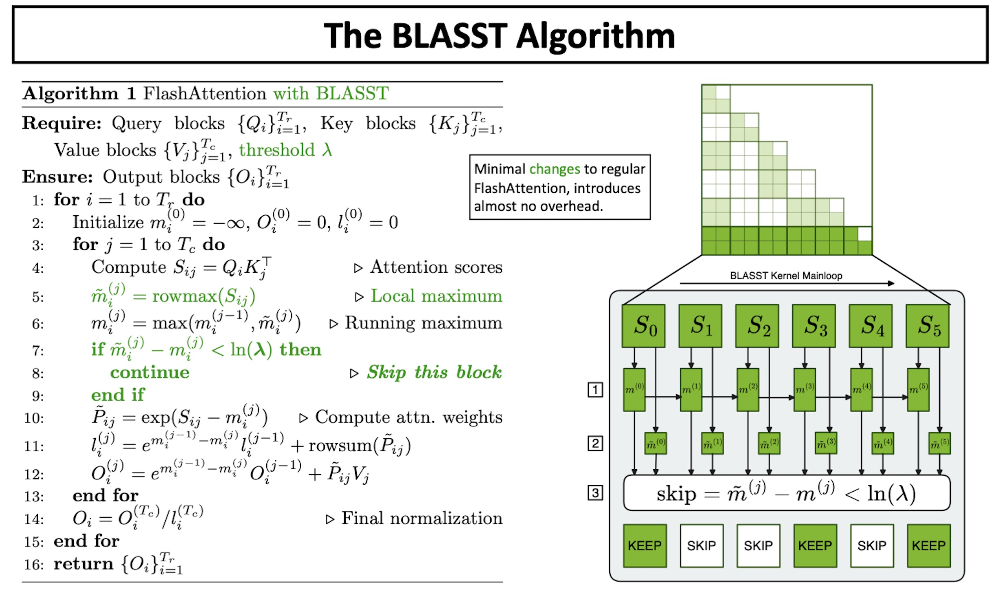

# Skip-Softmax

Skip-Softmax is the sparse-attention mode of the `TRTLLM_ATTN` backend. It implements
[BLASST](https://arxiv.org/abs/2512.12087) (Dynamic BLocked Attention Sparsity via Softmax
Thresholding), which adds a per-tile skip test to the FlashAttention main loop. This page describes the algorithm, how the user configuration is resolved
into the value the kernel consumes, and how checkpoint calibration and timestep gating participate
in that resolution. Configuration keys and operating-point guidance are covered in
[TRTLLM Attention](../../user_guide/diffusion/attention_backends/trtllm.md#skip-softmax); the
backend selection contract is covered in
[Diffusion Attention Backend Selection](attention_backend_selection.md).

## Motivation

In a long attention row (a video DiT can have tens of thousands of keys), the softmax weight
concentrates on a small fraction of the keys; the rest receive near-zero weight and barely move the
output. Computing softmax and the value-weighted sum over those keys is wasted work. Skip-Softmax
detects, per tile of keys, when a tile cannot matter and skips its softmax and its value multiply.

It is approximate: a skipped tile still carries a small non-zero contribution, so the mode is
opt-in and off by default.

## Algorithm



FlashAttention computes attention in a single streaming pass over KV tiles. Per query row the
kernel maintains three running values:

- `m` — the largest score seen so far,
- `l` — the running denominator `Σ exp(sⱼ − m)`,
- `O` — the running numerator `Σ exp(sⱼ − m)·vⱼ`,

and returns `O / l` at the end. For each KV tile it computes the scores `QK_j^T`, updates `m`, and
accumulates the tile's contribution into `l` and `O`. Rescaling `l` and `O` when `m` grows keeps the
dense pass numerically exact.

A tile is a block of query rows against a block of keys, and the kernel processes it as a unit.
BLASST inserts one test between computing a tile's scores and accumulating them. For each query
row `i` in the tile, let `tile_max[i]` be the row's largest score within the tile, `running_max[i]`
the row's running maximum, and `λ` the effective threshold:

```text
if all(exp(tile_max[i] - running_max[i]) < λ for every row i in the tile):
    skip this tile          # do not compute its Softmax or PV contribution
```

`exp(tile_max[i] − running_max[i])` is an upper bound on the softmax weight any key in the tile can
receive in row `i`: if even the row's best key in this tile is far below the row's current maximum,
the tile is unimportant for that row. Only when this holds for every row in the tile can the
Softmax and `PV` work for the tile be skipped, in which case its contribution to `l` and `O` is
simply omitted. A larger `λ` makes the test more aggressive. The figure states the same test in
log space, `m̃ − m < ln(λ)`, which is how the kernel evaluates it.

The test needs the tile's scores, so `QK_j^T` always runs and only the Softmax and `PV` work can
be skipped. Since the two matmuls have the same FLOP count, skipping every eligible tile removes at
most roughly half of the attention arithmetic, and the kernel-level speedup stays well under 2×.

## From configuration to the kernel threshold

The FlashInfer kernel does not take `λ` directly. It takes a `threshold_scale_factor` and divides
it by the KV sequence length of the call:

```text
λ = threshold_scale_factor / max_kv_len
```

vLLM-Omni resolves the factor from one of two mutually exclusive user controls:

| Control | Factor passed to the kernel | Resulting `λ` |
| --- | --- | --- |
| `threshold` | `threshold * max_kv_len` | `threshold` |
| `target_sparsity=s` | `a * exp(b * s)` | `a * exp(b * s) / max_kv_len` |

`threshold` is therefore `λ` itself and is independent of sequence length: the same value yields
the same per-tile test at any resolution or frame count. `threshold=0` skips no tiles. Because the
left-hand side of the skip test lies in `(0, 1]`, values in `(0, 1)` are the meaningful range; the
schema accepts any finite non-negative value.

`target_sparsity` selects a point on a curve fitted per model by
[NVIDIA ModelOpt](https://github.com/NVIDIA/Model-Optimizer/tree/main/examples/diffusers/sparsity),
so that `s` lands near that fraction of skipped tiles on the calibration data. The coefficients
`a` and `b` come from the checkpoint; the achieved sparsity on another prompt, shape, or layer can
differ.

### Skip-Softmax calibration config

ModelOpt stores the calibration in each transformer component's `config.json` under
`sparse_attention_config`. The following is taken from the `transformer/config.json` of
[`nvidia/Wan2.2-T2V-A14B-Diffusers-FP8`](https://huggingface.co/nvidia/Wan2.2-T2V-A14B-Diffusers-FP8),
with the `ignore` list abridged:

```json
{
  "sparse_attention_config": {
    "config_groups": {
      "group_0": {
        "algorithm": "skip_softmax",
        "targets": ["WanAttention"],
        "ignore": ["blocks.0.attn1", "blocks.0.attn2", "blocks.1.attn1", "..."],
        "threshold_scale_factor": {
          "formula": "a * exp(b * target_sparsity)",
          "coefficients": {"a": 2822.6209952221557, "b": 4.388250623520793}
        },
        "target_sparsity": 0.7,
        "disabled_until_timestep": 0.93
      }
    }
  }
}
```

A checkpoint with several transformer components carries one such config per component, each
with its own coefficients; in this example, `transformer_2/config.json` holds the low-noise
expert's curve.

vLLM-Omni consumes `formula`, `coefficients`, and `ignore`, and ignores `targets`,
`target_sparsity`, and `disabled_until_timestep`:

- Only the formula `a * exp(b * target_sparsity)` is accepted; a checkpoint with any other formula
  is rejected at startup. If a spec requests `target_sparsity` and the checkpoint carries no
  calibration, startup fails and the error points to `threshold` as the calibration-free
  alternative.
- Each component's curve is applied to that component's attention layers. If the config for a
  secondary component such as `transformer_2` cannot be read, that component stays dense and a
  warning is logged.
- `ignore` holds fnmatch patterns matched against both the full module name and the name relative
  to the component, so `blocks.0.attn1` matches `transformer.blocks.0.attn1` as well as
  `transformer_2.blocks.0.attn1`. Matching layers receive no coefficients and therefore stay dense
  regardless of the user configuration.

At each attention call, a layer with a `threshold` uses it directly; a layer with
`target_sparsity` and stamped coefficients evaluates the curve; a layer with `target_sparsity` but
no coefficients runs dense. The timestep gate below is applied to the result before it reaches the
kernel.

## Timestep gating

The early, high-noise denoising steps set the global structure of the output, and their errors
propagate through every later step. Keeping just these steps dense markedly improves the quality
of the generated video at a small cost in skipped work. `disabled_until_timestep` implements this:
on each attention call the backend compares the current normalized timestep `t` against the
configured cutoff and passes no skip factor to the kernel while `t` is above it. Skip-Softmax
becomes active on the first step whose `t` is at or below the cutoff and stays active for the rest
of the run, since `t` only decreases.

The default `disabled_until_timestep = 0` is a sentinel rather than a cutoff: the gate is off, the
timestep is never read, and Skip-Softmax runs on every step. Any positive value enables the gate.
`disabled_until_timestep = 1.0` therefore also yields no dense steps on a pipeline that publishes
`t`, but on a pipeline that does not publish it the backend stays dense and logs a warning once
rather than guessing from the step index.

### Where `t` comes from

The pipeline publishes `t` once per denoising step before running the transformer. It is the
scheduler's own position in `[0, 1]`, decreasing from near `1.0` (pure noise) to `0.0` (clean
sample): scheduler-based pipelines publish the scheduler timestep divided by `num_train_timesteps`,
and rectified-flow pipelines publish the current sigma. `t` is deliberately not the step index
divided by the step count. Schedulers place their steps non-uniformly in `t`, so expressing the
cutoff in `t` ties it to the same noise level across step counts and schedulers.

### Mapping the cutoff to denoising steps

For a run whose published sequence is `t[0], ..., t[N-1]`, the number of dense steps is

```text
dense_steps = count(t[i] > disabled_until_timestep)
skip_softmax_steps = N - dense_steps
```

This count **depends on the schedule**, and schedules differ from model to model: the
scheduler family, the number of steps, and any time shift all change where the steps land in `t`.
The same cutoff can therefore gate a very different fraction of the run on two models. Take
MiniMax-H3 as an example. Its video branch uses a flow-shifted rectified-flow schedule that applies
a shift `s` to `N + 1` uniform positions `u` from `1` to `0`,

```text
t = s * u / (1 + (s - 1) * u)
```

and a large `s` pushes most positions toward `t ≈ 1`. With the default `s = 12` and
`num_inference_steps = 50` (50 sigma points, `N = 49` denoiser forwards), the published sequence
starts `1.000, 0.998, 0.996, 0.995, 0.993, ...` and stays above `0.9` for 28 steps, giving:

| `disabled_until_timestep` | Dense steps | Skip-Softmax steps |
| :---: | ---: | ---: |
| `1.00` | 0 | 49 |
| `0.99` | 6 | 43 |
| `0.97` | 14 | 35 |
| `0.95` | 19 | 30 |
| `0.90` | 28 | 21 |
| `0.86` | 33 | 16 |

These numbers hold only for that schedule. A model with a smaller shift, a different step count,
or a scheduler that is not rectified flow produces a different sequence and a different table; a
request that overrides `flow_shift` or the step count changes it for MiniMax-H3 too.
Choose the cutoff by counting against the schedule actually served, not by reusing a value from
another model.
