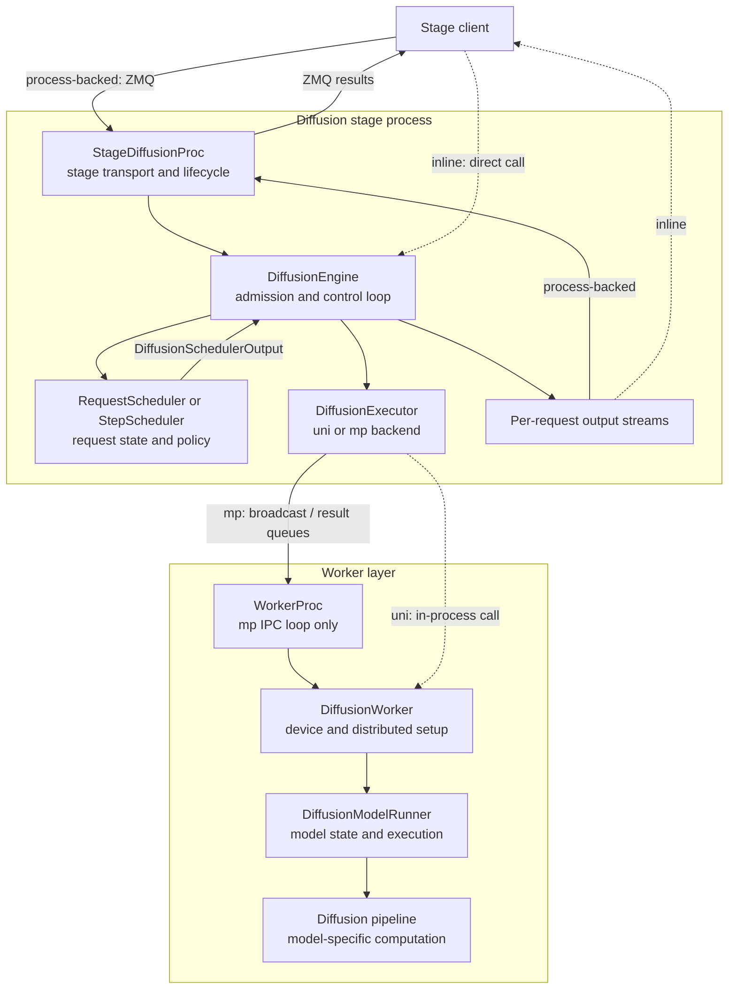
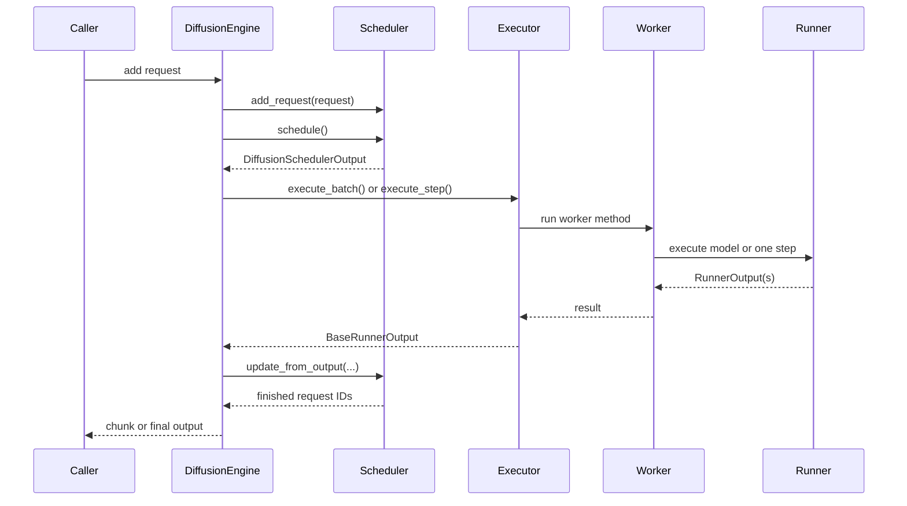
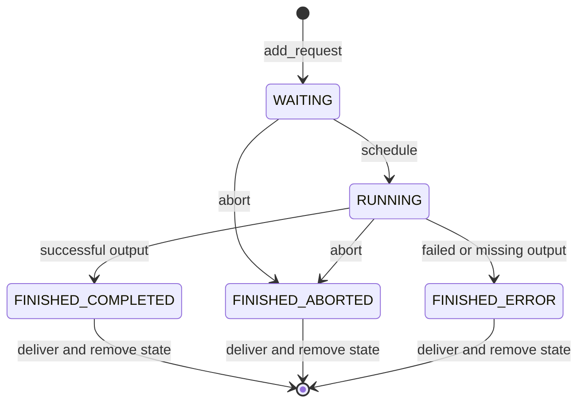

# Diffusion runtime

The diffusion runtime owns request admission, scheduling, execution, progress,
output, cancellation, and cleanup inside a diffusion stage.

It is easiest to think of the runtime as a small control loop:

1. the **scheduler** chooses ready requests;
2. the **executor** sends that choice to the worker layer;
3. each **worker** manages its device and delegates model work to a **runner**;
4. the runner calls the model pipeline and returns per-request results; and
5. the engine feeds those results back to the scheduler and output streams.

!!! note

    This page describes the runtime plumbing. Model loading and pipeline
    contracts belong to [Diffusion model integration](diffusion_model_integration.md).
    Batch compatibility and step-state details belong to
    [Diffusion continuous batching](continuous_batching.md).

## Goals and non-goals

The runtime aims to keep request policy separate from device execution. It
also keeps request identity stable from admission through the final output,
including cancellation and failures.

This module does **not** choose the next Omni stage, place stage replicas, or
define a model's denoising algorithm:

- cross-stage routing belongs to [Engine orchestration](../engine_orchestration.md);
- process placement and replica lifecycle belong to
  [Stage runtime](../stage_runtime.md); and
- model-specific work belongs to
  [Diffusion model integration](diffusion_model_integration.md).

## Runtime at a glance

The stage owns `DiffusionEngine` and a `DiffusionExecutor` backend. The inline
stage client keeps that stack in the caller process; a process-backed stage
runs it inside `StageDiffusionProc`.

The executor then chooses how the worker runs:

- **`uni`** (default when `num_gpus == 1`): `UniProcDiffusionExecutor` builds
  one in-process worker. There is no worker subprocess and no shared-memory
  RPC.
- **`mp`** (default when `num_gpus > 1`, or when set explicitly):
  `MultiprocDiffusionExecutor` starts one `WorkerProc` per device.

Either way, each worker owns its device, distributed state,
`DiffusionWorker`, `DiffusionModelRunner`, and pipeline instance.

!!! info "Stage process vs worker process"

    A deployed stage may already run in a `StageDiffusionProc` child process.
    That is separate from the optional `mp` worker processes. With `uni`, the
    worker lives in the same process as the engine.

## Component responsibilities

| Component | Owns | Does not own |
| --- | --- | --- |
| `DiffusionEngine` | Admission, the busy loop, scheduler/executor coordination, RPC ordering, output streams, warmup, abort routing | Batch policy details, device setup, model computation |
| `BaseScheduler` | Request states, waiting/running sets, capacity, compatibility, terminal transitions | IPC, worker calls, output formatting |
| `RequestScheduler` | Complete-request waves and optional admission delay for request-level batching | Denoising-step progress |
| `StepScheduler` | Per-request denoising progress and step-wise completion | Pipeline tensors and model state |
| `DiffusionExecutor` | Execution backend contract, worker RPC, health, shutdown | Admission and request-state transitions |
| `UniProcDiffusionExecutor` | Single in-process worker for `num_gpus == 1`; no IPC or async output pump | Multi-GPU execution |
| `MultiprocDiffusionExecutor` | Worker processes, shared-memory message queues, result dispatch, worker monitoring | In-process single-GPU path |
| `WorkerProc` | One `mp` worker process's IPC loop and reply rules | Scheduling policy; unused by `uni` |
| `DiffusionWorker` | Device/distributed setup, LoRA activation, profiling, sleep/wake, runner delegation | Request admission |
| `DiffusionModelRunner` | Pipeline loading, request-local model state, cache/compile setup, request or step execution | Queueing and cross-stage routing |

The boundary between policy and execution is
`DiffusionSchedulerOutput`. It contains newly admitted request payloads,
IDs for requests whose runner state is already cached, finished IDs,
optional KV-prefetch work, and per-request `diffusion_kv_metadata` on
`NewRequestData` envelopes when paged Diffusion KV is enabled. Executors and
workers consume this output; they do not decide what should run next.

`BaseScheduler.initialize()` sets `max_num_running_reqs` from
`od_config.max_num_seqs` (default 1). The engine may override that capacity
for distributed layerwise offload with AllGather DP concurrency.

## One scheduling tick

Async requests share one engine busy loop. Worker calls and control RPCs pass
through that loop, so they cannot race on the executor transport.

The engine catches request execution errors and turns them into per-request
error outputs. A dead worker group is different: the executor marks itself
failed, health checks raise `EngineDeadError`, and the owning stage client
handles the stage-level failure.

## Execution modes

The engine resolves one mode at startup and binds the matching scheduler and
executor call.

| Mode | Scheduler | Executor call | Runner path |
| --- | --- | --- | --- |
| Request batch | `RequestScheduler` | `execute_batch()` | `execute_model()` for one request, or `execute_model_batch()` for a fused batch |
| Step batch | `StepScheduler` | `execute_step()` | `execute_stepwise()` |

**Request mode** runs a complete pipeline forward for each scheduled wave. A
single-request wave is the conservative path. A multi-request wave usually
uses fused `execute_model_batch()` and requires the pipeline to declare
request-batch support.

**Distributed layerwise offload with AllGather (DLO DP concurrency)** is a
separate multiproc dispatch path. It activates when
`data_parallel_size > 1`, `enable_distributed_layerwise_offload` is set, and
`dlo_use_allgather` is true. The engine then sets `dp_concurrent = True` and
raises `scheduler.max_num_running_reqs` to `dp_size`, overriding the
`max_num_seqs` value from `initialize()`. The scheduler still emits a
multi-request `DiffusionSchedulerOutput`; the multiproc executor routes that
wave through `execute_request()` instead of fused `execute_model_batch()`.

Optional admission coalescing can fill a `dp_size` wave: when
`request_batch_max_wait_ms > 0`, `RequestScheduler` may wait briefly before
the first schedule of a wave (under `dp_concurrent`, the stable window is
`min(0.3s, wait/2)`). With the default `request_batch_max_wait_ms == 0`,
there is no wait.

Before dispatch, `MultiprocDiffusionExecutor.execute_request()` rejects waves
whose requests differ in sampling-parameter compatibility or `extra_args`
(AllGather requires every DP rank to follow the same forward schedule). Each
worker rank then picks one envelope from the wave:
`req[dp_rank % len(req)]`, so every rank enters the same collective while
computing different requests.

**Step mode** keeps `StepRequestState` in the runner. New requests run
`prepare_encode()` once; every tick runs `denoise_step()` and
`step_scheduler()`; completed requests run `post_decode()`. The scheduler keeps
only lifecycle and progress metadata—it does not hold model tensors.

**Step mode is also the path for streaming diffusion output**. Enabling
`streaming_output` turns on step execution if needed. Chunk-capable pipelines
can emit intermediate outputs through the same request stream; final-only step
pipelines still emit only the final result. If the pipeline does not implement
step execution, initialization fails.

!!! tip

    For user-facing flags and examples, see
    [Diffusion execution modes](../../../user_guide/diffusion/execution_modes.md).
    That guide explains how to select a mode; this page explains what happens
    after the choice is made.

## Request state and identity

The scheduler is the source of truth for an admitted request. Its normal state
flow is:

`PREEMPTED` and `BaseScheduler.preempt_request()` exist on the scheduler API,
but the engine loop does not call them today—only scheduler unit tests do.

`request_id` ties together scheduler state, runner state, executor results, and
the output queue. Batch positions are temporary and must never replace request
identity when results are mapped back.

Only compatible requests enter the same running wave. The scheduler compares a
mode-specific sampling-parameter key and stops at the first incompatible
waiting request. This is intentionally conservative and can cause
head-of-line blocking.

## Executor and IPC

`DiffusionExecutor` is the backend interface. Built-in backends are selected by
`distributed_executor_backend`:

| Backend | When chosen | Worker layout |
| --- | --- | --- |
| `uni` | Default for `num_gpus == 1`, or set explicitly | One in-process worker |
| `mp` | Default for `num_gpus > 1`, or set explicitly | One worker process per device |

Ray and external-launcher diffusion backends are not implemented. A custom
`DiffusionExecutor` subclass or import path is also accepted.

### Uniproc backend

`UniProcDiffusionExecutor` constructs `WorkerWrapperBase` in the engine process
and calls worker methods directly. It avoids a second model load, MessageQueue
rings, ZMQ IPC sockets, and `/dev/shm` tensor packing. RPC timeouts are
accepted for interface parity but are not enforced: a hung worker blocks the
calling thread. Sticky accelerator faults mark the executor dead through
failure callbacks; ordinary request errors stay per-request.

### Multiproc backend

`MultiprocDiffusionExecutor`:

1. creates a broadcast queue shared by all workers;
2. spawns one worker process per configured device;
3. waits until every worker reports ready;
4. sends generation and control calls as RPC messages;
5. applies rank-aware reply rules so only expected ranks respond; and
6. monitors worker process sentinels and fails the executor if a worker dies.

In request mode on this backend, each async output produces two correlated
messages keyed by `async_output_id`:

- `COMPUTE_DONE` — the forward finished and the device can start the next
  request.
- `OUTPUT_READY` — background D2H/SHM packing finished and the final output
  is ready.

The worker queues background packing work before it enqueues `COMPUTE_DONE`,
but either message may reach the executor first. The result pump and
`execute_batch()` must handle both orderings. Step mode keeps the synchronous
result path and does not start those pumps.

See [Async diffusion output](../../feature/async_diffusion_output.md) for the
multiproc request-mode timeline.

## Worker and runner boundary

On the `mp` path, `WorkerProc` receives messages and calls methods through
`WorkerWrapperBase`. On the `uni` path, the executor owns that wrapper
directly. In both cases, `DiffusionWorker` handles the parts tied to a device:
distributed initialization, model-runner construction, LoRA activation,
profiling, and memory sleep/wake. It delegates actual model work to
`DiffusionModelRunner`.

The runner owns long-lived model-side state:

- the loaded pipeline and compilation setup;
- cache and offload integration;
- random-generator setup;
- request batches for complete forwards; and
- `StepRequestState` plus `InputBatch` for step execution.

This split keeps infrastructure out of model pipelines. A pipeline receives a
request batch or step state and performs model work; it should not inspect
engine queues or change scheduler state.

## Lifecycle and cleanup

### Startup

`DiffusionEngine.make_engine()` resolves the engine class, constructs the
executor and scheduler, then normally runs a small dummy request to warm up the
model.

Warmup is skipped only when distributed layerwise offload with AllGather
is enabled (via `enable_distributed_layerwise_offload` and `dlo_use_allgather`)
and `max(data_parallel_size, sequence_parallel_size) > 1`, because
the dummy run sends one request while AllGather needs every shard rank to
enter the same collective. If initialization or warmup fails, the runtime
closes scheduler state and worker resources before returning the error.

### Cancellation

`abort()` places request IDs on an abort queue. The busy loop marks those
requests `FINISHED_ABORTED`; finalization removes scheduler state and emits an
aborted output when a consumer still exists. The runner removes cached
step-mode state when it receives a scheduler output that reports the finished
request ID.

On the multiproc request-mode async path, abort or consumer drop while output
is still materializing should release the associated async-output bookkeeping
so late results are not retained after the request ends
*(pending #6253/#6439/#6580)*. Today, an unconsumed `OUTPUT_READY` is cached
by design until `wait_output_ready()` or executor teardown. Dropping an
output-stream consumer removes that consumer's queue. It does not take
ownership of scheduler cleanup.

### Shutdown and worker failure

`DiffusionEngine.close()` is idempotent. It stops the busy loop, wakes pending
streams with an error, closes scheduler state, and shuts down the executor.

- **`mp`**: the executor asks workers to stop, waits for them, then terminates
  workers that miss the grace period. Shutdown marks unfinished RPC and
  async-output futures as failed, then clears them. Completed async outputs
  cached for later `wait_output_ready()` calls are dropped with the executor
  object.
- **`uni`**: the executor shuts down the in-process worker, drops the final
  model reference, and empties the accelerator cache so a later engine can reuse
  the device.

!!! warning

    Do not continue using a worker group after a fatal collective timeout or
    unexpected worker exit. Distributed state may be incomplete. The
    multiprocess executor deliberately fails closed so the stage can restart.
    The uniproc executor fails closed when the accelerator context itself is
    poisoned.

## Extension boundaries

- A custom engine may set `default_diffusion_model_runner_cls`; an explicit
  `diffusion_model_runner_cls` configuration still wins.
- Tests and custom engine integrations may inject a `BaseScheduler` subclass.
  `SchedulerInterface` remains only as a deprecated compatibility name.
- `distributed_executor_backend` may be `"uni"`, `"mp"`, a custom `DiffusionExecutor`
  subclass, or an import path. A backend must preserve scheduler output,
  request identity, health, and cleanup contracts. Use `"mp"` when you need
  process isolation or multi-GPU; `"uni"` is the single-GPU default.
- Worker extensions go through `WorkerWrapperBase`. They add worker methods;
  they do not become a second scheduler or request lifecycle.

These are advanced Python integration points, not stable end-user CLI
customization surfaces.

## Candidate invariants

### DIFF-RUNTIME-INV-001: One lifecycle owner

**Rule:** Every admitted request MUST have exactly one scheduler-owned lifecycle
until completion, cancellation, or failure.

### DIFF-RUNTIME-INV-002: Execution follows scheduler output

**Rule:** Executors and workers MUST execute scheduler decisions without
admitting, reordering, or forwarding requests independently. Distributed
layerwise offload with AllGather is an exception at dispatch time: the
scheduler may schedule a multi-request wave, but each DP rank executes one
envelope from that wave so every rank enters the same collective schedule.

### DIFF-RUNTIME-INV-003: Terminal cleanup is complete

**Rule:** Every terminal path MUST release request state, temporary tensors,
hooks, and runtime-owned resources. Async-output bookkeeping on abort or
consumer drop before consumption is also required *(pending #6253/#6439/#6580)*.

### DIFF-RUNTIME-INV-004: Optional features use runtime hooks

**Rule:** Cache, profiling, offload, and parallel features SHOULD integrate at
defined hooks instead of creating another request lifecycle.

### DIFF-RUNTIME-INV-005: Results keep request identity

**Rule:** Batched and asynchronous results MUST be mapped by stable request ID,
not by assumed completion order.

## Safe-change guide

Test the smallest affected slice, then cover its neighboring boundary:

| Change area | Minimum evidence |
| --- | --- |
| Admission or state transitions | `test_diffusion_scheduler.py`, including duplicate IDs, compatibility, abort, and missing output |
| Engine loop or output delivery | `test_diffusion_engine.py`, `test_diffusion_engine_cleanup.py`, `test_diffusion_engine_rpc_routing.py` |
| Executor or IPC | `test_multiproc_engine_concurrency.py`, `test_uniproc_executor.py`, `test_result_pump.py`, `test_diffusion_ipc.py`, `test_async_output_worker.py` |
| Worker or runner | `test_diffusion_worker.py`, `test_diffusion_model_runner.py` |
| Stage boundary | `test_stage_diffusion_proc.py`, `test_inline_stage_diffusion_client.py` |
| Warmup or streaming | `test_diffusion_engine_dummy_run.py`, `test_diffusion_streaming_output.py` |

Always exercise success, cancellation, per-request failure, fatal worker
failure, repeated shutdown, one request, and multiple compatible requests.
For step-mode changes, also test partial progress and cleanup of runner state.

## Related documents

- [Diffusion module overview](index.md)
- [Diffusion model integration](diffusion_model_integration.md)
- [Diffusion continuous batching](continuous_batching.md)
- [Diffusion execution modes](../../../user_guide/diffusion/execution_modes.md)
- [Async diffusion output](../../feature/async_diffusion_output.md)
- [Engine orchestration](../engine_orchestration.md)
- [Stage runtime](../stage_runtime.md)
