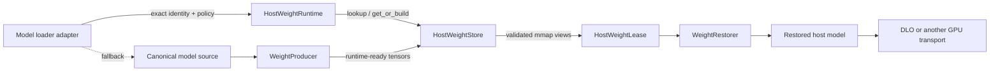

# Host Weight Runtime

The Host Weight Runtime is a loader-adjacent, transport-independent foundation
for reusing immutable, runtime-ready model weights. It separates the semantic
question—"are these exactly the weights this loader requested?"—from the
physical question—"where is the validated host representation stored?"

The runtime can save repeated checkpoint loading, transformation, and peak host
memory when several workers need the same final representation. It also creates
a second, versioned path for reconstructing a valid model, so a cache miss or
recoverable store failure normally falls back to the canonical loader.

This module does not enable host-weight caching for any model by itself. A model
integration must still provide an exact identity, a producer, and a restorer.
For feature behavior and consumer integration requirements, see the
[Host Weight Runtime feature design](../feature/host_weight_runtime.md).

## Component boundary



The contracts have deliberately narrow ownership:

- `HostWeightRuntime` applies resolution and fallback policy and emits one
  terminal resolution report. Explicit post-load publication emits a separate
  report and closes its store-returned lease before returning; it does not
  revise the completed resolution.
  The runtime does not own a model or call the canonical loader.
- `HostWeightStore` owns artifact lookup, coordinated construction,
  publication, validation, quarantine, and lifecycle.
- `HostWeightLease` owns process-local tensor views, mapped-file resources, and
  the shared artifact lock that stabilizes their lifetime.
- `WeightProducer` creates one declared final-layout representation. It writes
  only through a store-scoped writer and cannot publish paths directly.
- `WeightRestorer` validates a lease-to-model plan without mutation. Its
  one-shot `commit() -> None` is the sole model-mutating phase. Concrete
  restorers remain with the model or quantization integration.
- GPU transport owns page registration, private staging, H2D scheduling, and
  lease release. DLO must not parse manifests or manage store artifacts.

## Exact semantic identity

Storage lookup is exact; the store never coerces one representation into
another. `WeightArtifactIdentity` includes:

- immutable model revision and source-file fingerprint;
- component and ownership boundary;
- runtime representation, dtype, and representation metadata;
- final tensor layout and semantic parallel coordinates;
- static adaptation identity; and
- producer version, implementation fingerprint, manifest schema, and restorer
  schema.

Loader integrations may persist content digests for canonical source shards in
the selected storage domain. Reuse requires the same path, inode, size,
timestamps, symlink target, and cache-record checksum. Corrupt records are
rebuilt, and coordination or cache-I/O failure falls back to hashing the
canonical source directly. This is an identity-computation optimization, not a
second source of truth or an artifact substitution rule.

The identity excludes transfer policy such as registered mmap versus private
pinned staging. Those paths move the same host representation and must not
produce duplicate artifacts.

Parallel coordinates follow semantics rather than process topology:

- TP size and rank are included when they change tensor contents or shape.
- DP rank is excluded for replicated weights.
- SP size and backend are included when they affect layout. SP rank is excluded
  only when all SP ranks consume an identical representation.
- PP, EP, or future parallel modes must be added by the model adapter whenever
  they change component ownership or tensor layout.

Dynamic LoRA overlays are not cached as base weights. A statically merged
adapter is a distinct artifact identity with its own fingerprint.

## Deterministic resolution

The loader first resolves the canonical source and computes the exact requested
identity. The runtime then follows this order:

```text
validated local artifact
    -> exact remote artifact materialized locally (future)
    -> registered local producer
    -> canonical loader fallback, if policy permits
```

An already published local artifact wins because it avoids network transfer and
is already in node-accessible storage. "Wins" means the highest-priority valid
representation, not whichever backing responds first.

Configuration modes are:

- `disabled`: return the canonical-direct outcome without probing a root,
  credentials, topology, or identity;
- `preferred`: recoverable store failures may return canonical fallback; and
- `required`: fail when no exact lease can be acquired.

Failure-to-action policy is centralized in `HostWeightRuntime`. A clean miss or
invalid cache artifact may fall back in preferred mode. A typed failure may do
so only when it is marked retryable; unsupported capabilities, identity
collisions, producer failures, and publication failures remain visible as
startup failures.

`coordination_timeout_seconds` bounds acquisition of lookup and build locks; it
is not a hard wall-clock deadline for in-process validation, production, or
atomic publication. Once this V1 implementation becomes the producer, the
synchronous producer and publication run to completion. A hung producer blocks
its owning process and requires external process supervision; enforceable
producer cancellation requires a future process-isolated producer contract. A
waiter timing out never cancels another process's valid build.

Remote providers are represented by protocols but are explicitly unsupported
in the first implementation. Pre-load `resolve()` invokes only
`PRE_LOAD_SAFE` producers. A loader that completed canonical materialization
may explicitly call `publish_after_load()` with a `POST_LOAD_ONLY` producer
when `allow_post_load_publish` is enabled.

`allow_local_build` controls producer use during pre-load resolution;
`allow_post_load_publish` independently controls the explicit post-load entry
point. This permits lookup-only warm starts that populate a missing artifact
only after the canonical loader has established the current model.

Post-load publication is synchronous in V1, but its outcome is independent of
the already completed resolution. A store failure is returned in a separate
publication report and cannot turn a valid canonical model into a failed
resolution. On success, the runtime closes the validated store lease before
returning the report. Post-load publication only warms future startups; it does
not restore, rebind, or otherwise mutate the canonically loaded model serving
the current startup.

## Restoration transaction boundary

`WeightRestorer.plan_restore()` is validation-only: it must not modify the model
or lease. The returned plan may be committed exactly once, `commit()` returns
`None`, and commit is the sole phase allowed to mutate the model. Registration,
staging, and GPU transfer remain transport responsibilities rather than restore
side effects.

If planning fails, preferred-mode canonical fallback may reuse the untouched
model. If commit begins and then fails, the model is considered partially
hydrated and must be discarded; canonical fallback must construct a fresh model
instance instead of reusing it.

## Filesystem domain and artifact lifecycle

A storage domain describes physical locality and policy; it is not part of
semantic identity. The first implementation supports node- or NUMA-scoped
roots on verified local disk filesystems or tmpfs. The detected kernel
filesystem type is preserved in `domain.json` and inspection output. Known
remote filesystems and unknown filesystem types are rejected rather than being
silently treated as local disk, because cross-node page cache and advisory-lock
semantics do not satisfy this backend's contract. A NUMA root alone does not
guarantee page placement; CPU pinning, local first-touch/prefault, and residency
evidence belong to a later topology-aware integration.

```text
<domain>/
├── domain.json
├── domain-policy.json
├── locks/
│   ├── <identity>.build.lock
│   └── <identity>.artifact.lock
├── artifacts/<identity>/
│   ├── READY.json
│   ├── manifest.json
│   └── *.safetensors
├── tmp/
├── quarantine/
└── deny/
```

Lock files live outside replaceable artifact directories. Every cooperative
mutation follows one lock order: build lock, then exclusive artifact lock.
Lookup acquires a shared artifact lock, validates `READY` and the manifest,
opens payloads with non-following descriptor-based access, creates mmap-backed
views, and transfers that shared lock to the lease.

Lease acquisition rechecks the producer and restorer schemas against the exact
identity. Malformed safetensors payloads are reported as typed invalid
artifacts and denied rather than escaping the resolution policy as raw parser
exceptions.

Each `FileLock` records its creator PID. A forked child closes an inherited lock
descriptor without issuing `LOCK_UN`, because `flock` state belongs to the
shared open-file description and unlocking in the child would also release the
parent's active lease lock.

Publication follows this lifecycle:

```text
ABSENT -> invisible temporary build -> fully hashed and fsynced
       -> atomic rename -> READY

READY -> denied -> quarantined -> explicit removal
```

`READY.json` is written last in the temporary directory. Readers therefore see
either a complete validated artifact or a miss, never an in-progress build.
Failed process-local builds are left invisible and a later build owner removes
their stale temporary directories. Explicit cleanup is nonblocking and reports
an active builder or lease instead of unlinking live mappings.

## Validation and capacity

Every publication computes full file and tensor hashes. Local lookup supports:

- `manifest_and_metadata`, which validates identity, immutable publication
  metadata, file descriptors, sizes, tensor keys, shapes, dtypes, and strides;
  and
- `full_checksum`, which additionally reads and hashes every payload file.

An ordered producer may compute file and tensor digests while payload bytes are
written and overlap each closed payload's `fsync` with later producer work. An
unordered producer retains parallel readback hashing. In both cases manifest
and `READY` publication wait for every payload digest and `fsync`; the atomic
publication and validation contract is unchanged.

Filesystem verity is modeled but unsupported. Invalid artifacts receive an
external deny marker before their shared lookup lock is released; a build owner
then quarantines the immutable directory under the exclusive lock.
Lookup checks the marker both before validation and after constructing the
lease so a weaker overlapping lookup cannot return a lease after a stronger
validation has denied the artifact.

If publishing the external deny marker fails, lookup returns a retryable
storage failure and marks the artifact directory with a persistent invalidation
mode before releasing the shared lock. Cooperating readers check that mode both
while opening and immediately before returning a lease. Lookup then makes a
bounded attempt to take the exclusive artifact lock and quarantine the entry;
the quarantine transition removes the internal mode marker. If a cooperating
builder replaces the marked inode while the locks are exchanged, containment
preserves that new publication instead of quarantining it. If neither the
external marker nor the directory-mode marker can be persisted, cross-process
exclusion cannot be guaranteed on an unavailable filesystem and the domain
must remain failed rather than treating the artifact as an ordinary invalid
cache entry.

New publications carry the internal invalidation mode through the staging
rename. Hardening clears it and is the logical authority transition for a
process crash; the temporary- and artifact-parent syncs then make the rename
durable, with an artifact-inode sync first making the hardened mode durable. A
process that dies before hardening leaves a persistently denied
entry, while one that dies after successful hardening leaves an authoritative
ready entry. Any synchronous failure after rename is marked invalid and
contained in quarantine before `PUBLICATION_FAILED` is returned, so that
nonretryable result cannot later resolve as a ready hit. If the filesystem
refuses both the inode marker and the quarantine move, the store instead returns
a retryable storage failure with `outcome_uncertain` details; as with deny-marker
double failure, cross-process exclusion cannot be guaranteed until storage
recovers. Once the artifact-parent sync succeeds, a later artifact- or
build-lock release error is logged and lookup resolves the committed entry
instead of reporting a contradictory publication failure. The same authority
rule applies when a competing publisher already installed byte-identical
semantic content; staging-cleanup errors are retried without downgrading that
validated ready entry to publication failure.

Before widening a hardened artifact for a lifecycle move, the store durably
sets the same invalidation mode. A process crash before rename therefore leaves
the writable source denied. After rename, the store re-hardens the destination
but retains the marker until both parent-directory syncs make the move durable;
only then does it durably clear the marker. An interrupted move therefore leaves
a marked transition that the next exact-key lifecycle operation re-hardens.
Explicit cleanup uses the locked move and retries exact-key
`.cleanup.*` tombstones left by an interrupted removal; a later build performs
the same tombstone reconciliation before producing replacement content.

An operational failure while inspecting a noncooperative competing publication
is a retryable storage failure. The competing entry remains authoritative and
is not mislabeled as corrupt or quarantined merely because its manifest could
not be read transiently.

`inspect_domain()` and `inspect_artifact()` return typed, read-only snapshots.
Inspection validation does not create a deny marker. Reported lock activity is
point-in-time evidence only; kernel locks are not a persistent owner registry.

Capacity policy covers all store-owned bytes, including ready, temporary, and
quarantined data. The local writer preflights `max_artifact_bytes`,
`max_store_bytes`, and `min_free_bytes`, and preallocates payloads where the
filesystem supports it. `ENOSPC` remains a normal typed store failure because
concurrent preflight is inherently racy. Automatic eviction and strict
concurrent reservations are not implemented.

For tmpfs, artifact bytes are host-memory consumption and may consume swap;
they must not be reported operationally as ordinary disk capacity. The store
owns files and reports capacity. The kernel controls page-cache residency, and
transport controls registration or page locking.

## First implementation scope

The foundation implements a CPU local filesystem store and
`SINGLE_PROCESS` production for one exact artifact. It intentionally adds no:

- public CLI or DLO configuration;
- BF16, FP8, or model-specific producer/restorer;
- change to DLO AllGather or no-AllGather behavior;
- CUDA registration, pinned staging, or H2D scheduling;
- remote provider, group-cohort producer, artifact bundle, eviction, or
  cross-node coordination.

Consumer PRs must prove ordinary-loader parity, warm-hit work avoidance,
parallel-layout correctness, clean teardown, shared-backing evidence, and
representation-specific startup and memory behavior. Generic foundation tests
remain CPU-only and make no production performance claim.

The complete rationale and staged rollout are tracked in
[RFC #6414](https://github.com/vllm-project/vllm-omni/issues/6414).
